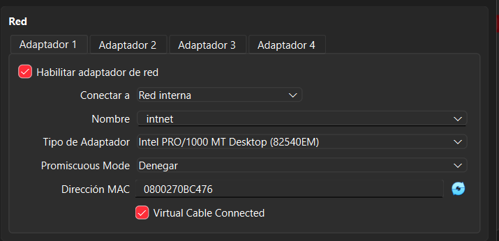
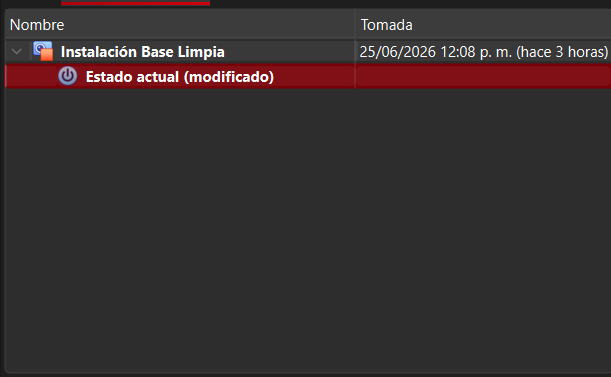

Laboratorio de Seguridad: Entorno Virtual Aislado con VirtualBox

## 1. Especificaciones de la Máquina Virtual

| Parámetro         | Valor configurado              |
|-------------------|--------------------------------|
| Nombre de la VM   | `lab-seguridad-01`             |
| Sistema Operativo | Windows 11 (64-bit)            |
| RAM asignada      | 2048 MB (2 GB)                 |
| CPUs asignadas    | 2 núcleos                      |
| Almacenamiento    | 25 GB (disco dinámico)         |
| Modo de red       | **Red Interna (Internal Network)** |

## 2. Configuración de Red

### Modo elegido: Red Interna (*Internal Network*)

### Justificación técnica

Se eligió el modo Red Interna porque el propósito ya que asi no hay conexion a internet y mantenemos un ambiente de seguridad en un entorno completamente controlado. Este modo crea un segmento de red virtual privado y cerrado, en el que únicamente pueden comunicarse las máquinas virtuales que pertenezcan explícitamente a esa red interna, sin ningún tipo de enrutamiento hacia el adaptador físico del Host ni hacia la red doméstica. 

Se descartó el modo Puente (Bridged Adapter) por razones de seguridad fundamentales: en ese modo, la máquina virtual se comporta como un dispositivo más dentro de la red local física, obteniendo su propia dirección IP del router doméstico y siendo visible para el resto de dispositivos de la red. Esto representa un riesgo real, ya que cualquier servicio vulnerable o malware de prueba dentro de la VM podría propagarse a otros equipos de la red doméstica, anulando completamente el principio de contención.

El modo Solo-Anfitrión (Host-Only) también fue evaluado, pero permite comunicación entre la VM y el Host, lo que no es necesario para esta práctica inicial donde el foco es el aislamiento más estricto posible.

## 3. Snapshot: Punto de Restauración Inicial

### Snapshot creado: `Instalación Base Limpia`

## Autor

**Alejo**
Curso: Ciberseguridad - Coderhouse
